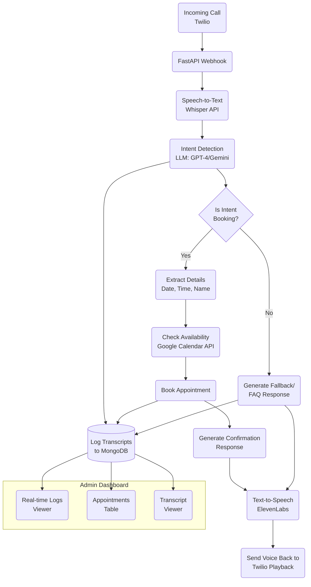

# Project Overview: VirtualCallAI – AI-Powered Voice Assistant for Enterprises

## 📌 Overview

**VirtualCallAI** is an intelligent, always-available voice assistant designed for enterprises. It can receive incoming voice calls, understand user intent in natural language, and perform context-aware actions such as booking appointments, answering frequently asked questions, or routing conversations—all autonomously, without human intervention.

The assistant integrates voice capabilities with cutting-edge AI models, enabling real-time, natural, and professional interactions with customers. Ideal for service-based businesses (e.g., clinics, salons, repair shops), VirtualCallAI automates appointment scheduling and customer interactions—reducing operational costs and improving customer experience.

---

## 🎯 Core Features

- **24/7 Voice Call Reception** using Twilio
- **Speech Recognition** via OpenAI Whisper for transcribing voice to text
- **Natural Language Understanding** with GPT-4 / Gemini 1.5
- **Appointment Scheduling** through Google Calendar or internal booking APIs
- **Text-to-Speech Responses** using ElevenLabs or Google TTS
- **Real-Time Admin Dashboard** to monitor calls, bookings, and transcripts
- **MongoDB-based Storage** for logs, user interactions, and call records

---

## 🧠 What the Assistant Does

- Picks up customer calls automatically via Twilio.
- Understands caller’s intent using LLMs.
- Responds naturally using real-time Text-to-Speech.
- Handles appointment booking flows:
  - Detects date, time, name, and service type.
  - Checks availability.
  - Books the appointment.
  - Confirms the booking to the caller.
- Stores conversation history and booking logs in MongoDB.
- Allows admin review and monitoring via a web dashboard.

---

## 🧱 System Architecture

